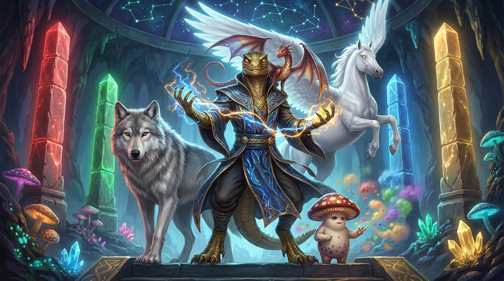

# Campaign Journal: The Trials of the Choosing

**Session Date:** 2025-12-29
**Player:** the Player (young)
**DM:** Rob (human) + Claude (AI co-DM)
**Adventure:** The Trials of the Choosing

---

## Quick Reference

### Current Status
- **Location:** Flying to Temple on Starwind - Temple under shadow attack!
- **Story Beat:** Act 3 - FINALE: Shadow Sorcerer (starting)
- **Time Elapsed:** ~50 / 90 minutes

### Character Established
- **Setting:** Underground cave village with bioluminescent fungi and crystals
- **Home:** Cave bedroom with a river running through it, fish swimming inside
- **Parents:** Fun and caring (like his real parents)
- **Beloved NPC:** **Spore the Myconid** - little mushroom buddy, captured by Shadow Sorcerer!
- **Pre-Choosing Form:** Glowing indeterminate figure in a robe - no defined species yet
- **Post-Choosing Form:** Lizardfolk (revealed after trials complete)

### Card Usage Tally
| Aspect | Count | Cards Used |
|--------|-------|------------|
| Warrior | 3 | Disarm, Reckless Strike, Mighty Blow |
| Hunter | 6 | Precise Shot ×3, Quick Shot, Sneak, Animal Friendship |
| Arcane | 15 | Magic Bolt ×3, Detect Magic ×3, Enchant ×4, Illusion ×2, Telekinesis ×3 |
| Divine | 12 | Protection Circle ×2, Healing Light ×4, Bless ×2, Smite ×2, Turn Undead ×2 |

**FINAL TALLY:**
- **Primary Aspect:** Arcane (15)
- **Secondary Aspect:** Divine (12)

**CHARACTER REVEALED (D&D 2024):**
- **Species:** Lizardfolk
- **Class:** Sorcerer
- **Subclass:** Draconic Sorcery (magic is in his blood, scales manifest his power)
- **Background:** Guide (knows the underground paths, the hidden ways, the secrets of the deep places)

### Companions & Allies

| Ally | How Acquired | Status |
|------|--------------|--------|
| **Darkstorm** (Dire Wolf) | Trial 1 - Smite + Healing Light freed from shadow curse | Following on ground to Temple |
| **Pip** (Pseudodragon) | Trial 3 - Animal Friendship + Healing Light + Enchant (memory link) | On shoulder, bonded |
| **Starwind** (Pegasus) | Trial 4 - NATURAL 20 rescue! Bless + Turn Undead + Smite + Healing Light | Being ridden to Temple |

### Key Decisions Log
*Tracking major choices that reveal character*

| Decision | Choice Made | What It Shows |
|----------|-------------|---------------|
| Dire Wolf encounter | Used illusions to confuse, then noticed pain and chose to HEAL instead of fight/flee | Compassion over combat, curiosity, protector instinct |
| Pip the pseudodragon | Used Enchant to link minds and SEE Pip's memories - went beyond just healing | Deep empathy, desire to understand, magical creativity |
| Starwind rescue | Used FOUR Divine cards at once, didn't give up when Smite failed (rolled 2), pushed through to nat 20 | All-in commitment, never gives up, protector of the innocent |

---

## Session Timeline

*Entries are added chronologically as the adventure progresses*

---

### ACT 1 - THE CHOOSING CEREMONY

**Scene 1: Morning at Home**
- the Player established his character lives in an underground cave with a river running through his bedroom
- Fish swim in the river inside his room
- Parents are like his real parents - fun and caring
- Has a myconid friend named **Spore**
- Said "Bye" to Spore before leaving

**Scene 2: Temple Ceremony**
- Received Aspect Cards from the Elder
- the Player's brilliant idea: Before Choosing, candidates are **glowing indeterminate figures** in robes - no species yet!
- After the trials, he will become a **Lizardfolk**

**Tutorial Pillars:**
1. 🔴 Red Pillar: Used **Disarm + Magic Bolt** - knocked away shield, then blasted dummy
2. 🟢 Green Pillar: Used **Detect Magic + Precise Shot** - saw through illusions, bullseye!
3. 🔵 Blue Pillar: Used **Enchant + Magic Bolt** - made a homing missile that tracked the teleporting crystal
4. 🟡 Gold Pillar: Used **Protection Circle + Healing Light + Bless** (TRIPLE!) - banished shadow AND made flower bloom brilliantly

---

### ACT 2 - THE TRIALS

**Trial 1: Dire Wolf at the Bridge**
- First used **Illusion + Enchant** to create decoy copies with real scent
- Wolf was confused but the Player noticed it was in pain, not attacking
- Chose compassion: **Smite + Healing Light** to destroy shadow chains and heal the wound
- Wolf became ally, named **Darkstorm**
- Key moment: Chose to help when he could have snuck past

**Trial 2: Goblin Ambush - COMPLETE (Victory!)**
- Round 1:
  - **Protection Circle** around merchant Garrett - arrows now useless!
  - **Illusion** (rolled 17) - FIVE perfect copies, goblins totally confused
  - **Quick Shot** - first arrow missed (6), second arrow hit boss (20) for 5 damage
  - Darkstorm missed ground goblin (rolled 7)
- Round 2:
  - **Enchant** on illusion copies - made them feel solid and real
  - **Reckless Strike** on ground goblin (rolled 20) - HIT for 6 damage!
  - **Mighty Blow** on boss (rolled 9) - missed
  - Darkstorm tried to run up tower (rolled 7, then 6 with advantage) - struggled on stairs
- Round 3:
  - **Enchant** on Darkstorm - gave the wolf FLIGHT!
  - **Quick Shot** at tower (10, 10) - missed
  - **Precise Shot** at ground goblin (16) - KILLED IT!
  - **Precise Shot** at boss (18) - hit!
  - Darkstorm flying attack (22) - SAVAGE hit on tower goblin!
  - Goblins hit back with two 17s - wounded hero
  - **Goblin Boss calls RETREAT!** - remaining goblins flee
- **Reward:** Garrett the merchant gave chocolate + rumor about trapped pegasus Starwind

**Trial 3: Maze of Echoes - COMPLETE!**
- Challenge 1 - Shifting Floor:
  - **Detect Magic** - saw which tiles were safe
  - **Telekinesis** (rolled 16) - tested tiles without stepping on them
  - **Sneak** - crossed safely with Darkstorm following
  - Perfect execution!
- Challenge 2 - Illusion Walls:
  - **Detect Magic + Telekinesis** (rolled NATURAL 20! - 23 total)
  - CRITICAL SUCCESS - saw through all illusions AND gained vision of entire maze
  - **Gained MAZE INSIGHT** - advantage on all remaining challenges!
  - Left path = fake (pit trap), Right path = fake (closing walls), Middle = real
- Challenge 3 - Sword Chamber:
  - Three floating swords about to attack!
  - Spotted control crystal in ceiling thanks to maze insight
  - **Magic Bolt** with advantage (rolled 17 and 14) - BOTH HIT!
  - Crystal shattered, swords fell harmless
- Finding Pip:
  - Discovered injured pseudodragon in hidden alcove
  - **Animal Friendship** - calmed the scared creature
  - **Healing Light** - fixed the bent wing
  - **Enchant** - created memory link, SAW Pip's past (chased by swords, hurt, alone)
  - Pip chose the Player! Now rides on shoulder, emotionally bonded

**Trial 4: Cursed Grove - COMPLETE! (EPIC VICTORY)**
- Found Starwind the pegasus bound by shadow chains
- Three shadows circling and draining her life
- Dark crystal at base of dead tree powering the curse
- the Player went ALL IN with FOUR Divine cards:
  - **Bless** on the dead trees (partial success)
  - **Turn Undead** (rolled 18!) - two shadows DESTROYED, one fled wounded
  - **Smite** on chains (rolled 2) - cracked but held!
  - **Healing Light** combined with Smite for final push
  - **NATURAL 20 on the final roll!**
- TOTAL VICTORY: Chains shattered, crystal exploded, last shadow destroyed
- Dead grove BLOOMED back to life!
- Starwind freed, pledged herself to the Player
- Now flying to Temple - Spore is in danger!

---

### ACT 3 - THE FINAL TRIAL

**The Temple Under Shadow**
- Starwind landed in corrupted Temple courtyard
- Four pillars dim, banners torn, cold mist everywhere
- Elder revealed: Shadow Sorcerer has taken Spore!
- The Sorcerer was once a Choosing candidate who failed and died bitter

**The Confrontation**
- Entered inner sanctum with all three allies (Darkstorm, Pip, Starwind)
- Found Spore bound in shadow chains on altar, releasing scared gray spores
- Shadow Sorcerer revealed themselves - centuries of jealousy and rage
- "I gave EVERYTHING and I FAILED. Now I'll take YOUR power!"

**The Final Battle**
- the Player carefully considered all his cards - took his time on this important moment
- Chose THREE cards for a coordinated strike:
  - **Turn Undead** (rolled 9+4=13 with Pip's advantage) - HOLY LIGHT EXPLOSION! Sorcerer staggered and burned!
  - **Telekinesis** (rolled 14+3=17) - SHATTERED the shadow chains! Spore freed!
  - **Precise Shot** (rolled 9+4=13) - Arrow through the chest! Sorcerer defeated!
- All three allies stood with him: Darkstorm roared, Pip screeched, Starwind reared
- Shadow Sorcerer's form faded - revealed the sad, lonely person they once were
- "Maybe that's what I was missing. Not power. Just... someone who cared."
- the Player chose silence - the Sorcerer faded without redemption

**The Transformation**
- Temple restored, stars glowing on ceiling again
- Spore freed, releasing rainbow spores of joy
- the Player's glowing indeterminate form solidified into LIZARDFOLK
- Scales manifested - green-brown, draconic heritage revealed
- The Choosing complete!

**The Choosing Ceremony**
- Elder announced the results
- Blue pillar (Arcane) blazed brightest, Gold pillar (Divine) pulsed in harmony
- Class revealed: **SORCERER** with **Draconic Sorcery**
- Background revealed: **GUIDE** - knows the hidden paths of the deep places
- Villagers and myconids celebrated, parents tearful with pride
- All companions gathered: Darkstorm, Pip, Starwind, and Spore

---

## FINAL ADVENTURE SUMMARY

**Session Date:** December 29, 2025
**Duration:** ~60 minutes
**Player:** the Player (young)
**DMs:** Rob (human) + Claude (AI co-DM)

### The Hero

| Attribute | Value |
|-----------|-------|
| **Name** | **LIGHTSWORD** |
| **Species** | Lizardfolk |
| **Class** | Sorcerer |
| **Subclass** | Draconic Sorcery |
| **Background** | Guide |
| **Home** | Underground cave village with river running through bedroom |

### Companions Acquired

| Companion | Type | How Acquired |
|-----------|------|--------------|
| **Darkstorm** | Dire Wolf | Trial 1 - Healed from shadow curse with compassion |
| **Pip** | Pseudodragon | Trial 3 - Found injured in maze, healed and mind-linked |
| **Starwind** | Pegasus | Trial 4 - Freed from shadow chains with nat 20 rescue |
| **Spore** | Myconid | Original friend from home - rescued from Shadow Sorcerer |

### Final Card Tally

| Aspect | Count | Percentage |
|--------|-------|------------|
| Arcane | 15 | 42% |
| Divine | 12 | 33% |
| Hunter | 6 | 17% |
| Warrior | 3 | 8% |

### Key Character Traits Demonstrated
- **Compassion over combat** - Healed the wolf instead of fighting
- **Creative problem-solving** - Enchanted illusions to feel real, made Darkstorm fly
- **Protector instinct** - Always shielded allies first (Protection Circle on merchant, Spore)
- **Deep empathy** - Used Enchant to SEE Pip's memories, understand its pain
- **Determination** - Didn't give up when Smite failed (rolled 2), pushed through to nat 20
- **Natural leader** - Gathered three powerful allies through kindness

### Memorable Rolls
- **Natural 20** on Maze Illusion Walls - gained complete maze insight
- **Natural 20** on Starwind rescue - chains shattered, grove bloomed
- **22** on Darkstorm's flying attack - savage hit on tower goblins

### Adventure Complete!
All four trials passed. Shadow Sorcerer defeated. Spore rescued. The Choosing crystallized.

**LIGHTSWORD's legend has just begun.**

---

## The Ballad of Lightsword

### "Scales of Starlight" (Tavern Version)
*A Bardic Ballad of Lightsword and the Trials of the Choosing*

**Musical Genre/Style:**
*An underground folk ballad in 6/8 time, meant to be performed on a deep-bodied lute or hurdy-gurdy. The verses are sung in a storytelling cadence - steady and building - while the chorus bursts into triumphant major chords. Myconid percussion (hollow mushroom drums) keep a heartbeat rhythm throughout. Best performed in a cavern for natural reverb, with bioluminescent fungi providing the stage lighting. The melody echoes dwarven mining songs but with an ethereal, magical quality that makes torches flicker and crystals hum.*

---

**VERSE 1**
*In caverns deep a hero woke, no form yet to his name,*
*A glowing child of mystery who'd soon earn endless fame,*
*Said goodbye to little Spore and walked to Temple's gate,*
*Four pillars blazed, four trials called - the Choosing would not wait!*

**VERSE 2**
*Upon the bridge a dire wolf stood, cursed chains upon its paw,*
*Most heroes raise a blade in fear at such a fearsome maw,*
*But Lightsword saw the suffering, the pain behind the rage,*
*He healed the beast with golden light - and Darkstorm turned the page!*

**CHORUS**
*Rise, O Lightsword! Rise through shadow, rise through fear!*
*Darkstorm, Pip, and Starwind - all your companions here!*
*Guide of the Deep Places, scales of starlight shown,*
*A Lizardfolk Sorcerer claims his destiny as his own!*

**VERSE 3**
*Through goblin horde and crystal maze, with wolf now at his side,*
*He saved a dragon, freed a horse with wings spread pure and wide,*
*A flying wolf! A mind-linked Pip! A pegasus of white!*
*Three companions joined his cause to stand against the night!*

**VERSE 4**
*The Shadow Sorcerer took Spore and laughed with bitter hate,*
*But Lightsword came with all his friends and sealed the specter's fate,*
*His glow became his scales at last - green-brown and burning bright,*
*"I am LIGHTSWORD!" rang his voice - a name to turn dark to light!*

**FINAL CHORUS**
*Rise, O Lightsword! Rise through shadow, rise through fear!*
*Magic blazing, allies gathering, legend starts right here!*
*From the depths unto the starlight, Draconic power sung,*
*The Trials of the Choosing done - but adventures just begun!*

---

*— The short version, for when the tavern's closing and the ale's running low*

---

### "Scales of Starlight" (Full Epic Version)
*For festivals, ceremonies, and long winter nights*

---

**VERSE 1**
*In caverns deep where rivers flow through bedrooms carved in stone,*
*A glowing child of mystery awoke to face the unknown,*
*No scales, no form, no certain shape - just light wrapped in a cloak,*
*Said goodbye to little Spore, and to the Temple spoke.*

**CHORUS**
*Rise, O Chosen! Rise through shadow, rise through fear!*
*Magic blazing, allies gathering, destiny draws near!*
*From the depths unto the starlight, scales of power shown,*
*The Guide of the Deep Places claims the path as his own!*

**VERSE 2**
*Four pillars taught him balance - red and green and blue and gold,*
*He struck with warrior's fury and let hunter's aim take hold,*
*But when the arcane crystal blinked and teleported fast,*
*He enchanted his own magic bolt - it caught it at the last!*

**VERSE 3**
*Upon the bridge a dire wolf stood, cursed chains upon its paw,*
*Most would raise a blade in fear at such a fearsome maw,*
*But the Chosen saw the suffering, the pain behind the rage,*
*Smite broke the chains, and healing light turned enemy to sage!*

**CHORUS**
*Rise, O Chosen! Rise through shadow, rise through fear!*
*Magic blazing, allies gathering, destiny draws near!*
*Darkstorm now runs beside him, loyal, fierce, and true,*
*The first companion of the journey - more will follow too!*

**VERSE 4**
*The goblins held the tower high, raining arrows down below,*
*A merchant trapped, a wolf enchanted - given power to FLY, you know!*
*Five illusions of the hero, Quick Shot arrows in the air,*
*The boss retreated, screaming - couldn't find him anywhere!*

**VERSE 5**
*The Maze of Echoes twisted paths with illusions, traps, and swords,*
*But a natural twenty opened eyes to see beyond the wards,*
*And in a hidden alcove small, a dragon hurt and crying,*
*He linked their minds with magic - saw her story, stopped her dying!*

**CHORUS**
*Rise, O Chosen! Rise through shadow, rise through fear!*
*Pip upon his shoulder now, chirping ever near!*
*Darkstorm runs, the dragon flies, but one more waits ahead,*
*A pegasus in shadow chains, nearly drained and dead!*

**VERSE 6**
*The Cursed Grove was dark as death, three shadows circling round,*
*Starwind's wings were gray and limp, chained to cursed ground,*
*He threw FOUR cards at once that day - Turn Undead blazed bright!*
*The shadows screamed and scattered from his holy burning light!*

**VERSE 7**
*The chains resisted - rolled a two! - but heroes don't give in,*
*He pushed and pulled and poured out light to break the grip of sin,*
*NATURAL TWENTY! Chains exploded! Crystal shattered wide!*
*The grove bloomed back to life again - Starwind at his side!*

**CHORUS**
*Rise, O Chosen! Rise through shadow, rise through fear!*
*Flying on the pegasus, the Temple drawing near!*
*But darkness holds the sanctum now, and Spore is trapped within,*
*The Shadow Sorcerer awaits - the final fight begins!*

**VERSE 8**
*"I failed!" the Specter wailed and raged, "I gave my everything!"*
*"Now I'll drain YOUR power, child, and finally be king!"*
*But Turn Undead and Telekinesis struck with furious might,*
*Precise Shot found its mark at last - the shadow lost the fight!*

**VERSE 9**
*The darkness faded, Temple healed, and Spore leaped to his arms,*
*Rainbow spores of joy exploded, safe from all the harms,*
*His glow solidified at last - green scales upon his skin,*
*A LIZARDFOLK SORCERER born - Draconic power within!*

**VERSE 10**
*"What name?" the Elder asked him then, as stars began to glow,*
*He raised his hand, a blade of light, and all the Temple know:*
*"I am LIGHTSWORD!" rang his voice through cavern, stone, and hall,*
*A name of power, hope, and fire - a hero's truest call!*

**FINAL CHORUS**
*Rise, O LIGHTSWORD! Rise through shadow, rise through fear!*
*Darkstorm, Pip, and Starwind - all your companions here!*
*Guide of the Deep Places, magic blazing like the sun,*
*The Trials of the Choosing done - but adventures just begun!*

**OUTRO (spoken, not sung)**
*So if you travel underground, through caverns dark and deep,*
*And hear the name of LIGHTSWORD where the glowing mushrooms creep,*
*With dire wolf and dragon small and pegasus of white,*
*Bow low and know you've met the one who turned the dark to light.*

---

*— As recorded by wandering bards who witnessed Lightsword's Choosing ceremony, now sung in underground taverns from the Myconid Hollows to the Crystal Depths*

---

### PRE-SESSION - Adventure Prepared

**What's Ready:**
- Aspect cards printed (24 cards, 4 aspects)
- Scene images generated (12 scenes + 4 trials + 4 tutorials)
- Session script reviewed
- Timer set for 90 minutes
- Equipment checked

**Adventure Structure:**
1. Temple Ceremony (15 min) - Tutorial pillars, receive cards
2. Trial 1: Dire Wolf Bridge (15 min) - Combat or compassion?
3. Trial 2: Goblin Ambush (15 min) - Tactical combat, rescue merchant
4. Trial 3: Maze of Echoes (20 min) - Puzzles, find Pip
5. Trial 4: Cursed Grove (15 min) - Free Starwind the pegasus
6. Finale: Shadow Sorcerer (10 min) - Confront the villain

**Safety Notes:**
- No zombies or undead humans (skeletons OK)
- Final boss is Shadow Sorcerer (hooded wizard), NOT undead
- Tone: Heroic and fun, celebrate creativity

---

## Memorable Quotes

*Capturing the best moments in the Player's own words*

> *(Session not yet started)*

---

## Session 1 Notes

*DM observations, pacing notes, things to remember*

- the Player loved the aspect card system - creative combinations encouraged
- Preferred compassion over combat at every opportunity
- The indeterminate form → species reveal was a hit
- Natural 20s on Starwind rescue and maze vision were memorable
- ~60 minutes total session time

---

## Session 1 Summary - COMPLETE

**Final Class Determined:** Sorcerer (Draconic Sorcery)
**Total Session Time:** ~60 minutes
**Allies Acquired:** Darkstorm (Dire Wolf), Pip (Pseudodragon), Starwind (Pegasus), Spore (Myconid)
**Favorite Moment (the Player):** TBD - ask after next session
**What the Player Wants Next:** TBD

---

---

# SESSION 2: THE DRAGON'S EGG
## Preparation Notes

**Adventure:** The Dragon's Egg
**System:** Full D&D 5e (transitioning from Aspect Cards)
**Characters:** Lightsword (Sorcerer 3) + Spore (Rogue 3) - BOTH as PCs
**Duration:** ~90 minutes planned

### Pre-Session Status

**Characters:**
- Lightsword: Level 3 Lizardfolk Sorcerer (Draconic Sorcery), Guide background
- Spore: Level 3 Myconid Rogue (Soulknife), Circle Keeper background

**Active Companions This Session:**
- Pip (Pseudodragon) - KEY ROLE: leads heroes to dragon

**Staying Home This Session:**
- Darkstorm (Dire Wolf) - senses dragon territory, guards home
- Starwind (Pegasus) - too large for deep tunnels

### Adventure Hook

Pip senses a psychic distress call from deep in the caves. Following the pseudodragon leads to **Emberheart**, a young copper dragon whose egg was stolen by a **Cult of Tiamat**. Lightsword and Spore must track the cultists and rescue the egg before a dark ritual corrupts it.

### Key NPCs

| NPC | Role | Notes |
|-----|------|-------|
| **Emberheart** | Quest-giver | Young copper dragon, grieving mother |
| **Brother Ashscale** | Villain | Cult Fanatic, true believer |
| **Marcus, Elena, Old Tomas** | Tricked Cultists | Not evil, just misled |

### Session Goals

1. [ ] Establish two-character play with full 5e mechanics
2. [ ] Pip gets spotlight as guide
3. [ ] Connect to Lightsword's draconic heritage
4. [ ] Spore's stealth abilities shine
5. [ ] Present moral choice about tricked cultists

### Files Created

- `adventure/session-2-dragon-egg.md` - Full session script
- `adventure/dragon-egg-dm-reference.md` - Stat blocks and DCs
- Scene images in `output/campaign-images/`

---

## Session 2 Timeline

*To be filled during play*

### ACT 1 - THE CALL
*(Pip's distress, Darkstorm stays behind)*

### ACT 2 - THE DRAGON'S LAIR
*(Meet Emberheart, learn the quest)*

### ACT 3 - TRACKING THE CULT
*(Pit trap, fire beetles, find the shrine)*

### ACT 4 - THE CULT HIDEOUT
*(Infiltration, combat/persuasion, save the egg)*

### ACT 5 - RESOLUTION
*(Return egg, get rewards, story hooks)*

---

## Session 2 Summary

*To be completed after the adventure*

**Outcome:** TBD
**Notable Moments:** TBD
**XP Earned:** TBD
**Story Hooks Planted:** Larger Tiamat cult, Emberheart's training offer
